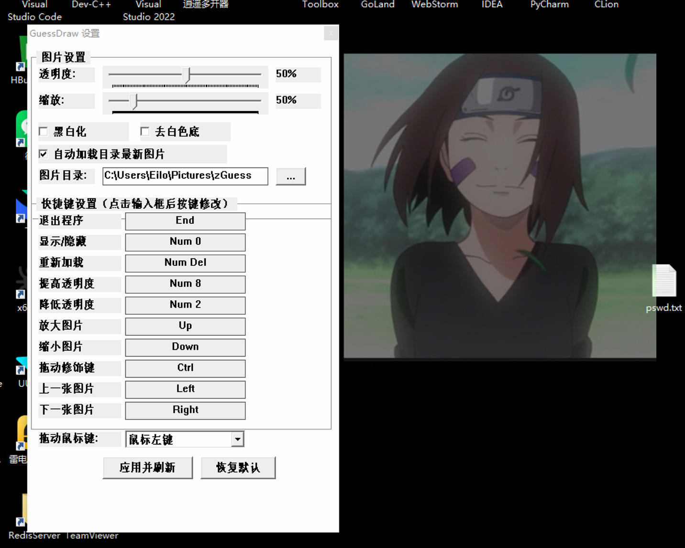

# GuessDraw

一款 Windows 桌面透明叠加图片工具，将参考图片以半透明方式覆盖在屏幕上，适用于临摹绘画、UI 对比、截图参考等场景。



## 使用说明

1. **首次运行** — 程序自动在 `我的图片\zGuess` 下创建图片目录和配置文件，将参考图片放入即可显示
2. **鼠标穿透** — 叠加图片不会拦截鼠标事件，可以正常操作下方窗口
3. **系统托盘** — 左键点击托盘图标打开设置面板，右键弹出快捷菜单
4. **设置面板** — 可调节透明度、缩放、黑白化、去白底等，滑块实时生效
5. **切换图片** — ← → 键切换上/下一张，默认自动加载目录最新图片
6. **拖动定位** — 按住 LCtrl + 鼠标左键拖动图片位置（修饰键和鼠标键可自定义）
7. **快捷键** — 所有操作均可在设置面板中自定义
8. **配置持久化** — 点击"应用并刷新"保存设置到文件；"恢复默认"一键还原

## 默认快捷键

| 功能 | 默认按键 |
|------|----------|
| 退出程序 | End |
| 显示/隐藏 | Num 0 |
| 重新加载 | Num Del |
| 提高透明度 | Num 8 |
| 降低透明度 | Num 2 |
| 放大图片 | ↑ |
| 缩小图片 | ↓ |
| 上一张图片 | ← |
| 下一张图片 | → |
| 拖动修饰键 | LCtrl |

> 拖动方式：按住修饰键 + 鼠标左键拖动（修饰键和鼠标键均可在设置中更改，修饰键可设为"无"）

## 配置文件

配置文件 `GuessDraw.ini` 位于图片目录下，包含以下配置项：

- `[Image]` — 图片目录、当前图片路径、透明度、缩放、黑白化、去白底、自动加载
- `[Hotkeys]` — 所有快捷键的 VK 码和修饰键
- `[Drag]` — 拖动鼠标键设置

---

## 环境配置 & 构建

### 依赖

- **编译器**：MinGW-w64 (GCC 12+)，需支持 C++20
- **构建工具**：CMake 3.20+
- **IDE**（推荐）：CLion

### 构建步骤

```bash
# 克隆项目
git clone https://github.com/Eilo-Dit/GuessDraw.git
cd GuessDraw

# CMake 构建（Release）
cmake -B cmake-build-release -DCMAKE_BUILD_TYPE=Release -G "MinGW Makefiles"
cmake --build cmake-build-release
```

> 已配置静态链接，生成的 exe 可独立运行，无需附带 DLL。

### 项目结构

```
GuessDraw/
├── src/
│   ├── main.cpp              # 程序入口、主窗口、消息循环
│   ├── core/
│   │   ├── globals.h         # 全局变量、枚举、控件 ID
│   │   ├── config.cpp        # 配置读写 (INI)、快捷键默认值
│   │   ├── drawing.h/cpp     # 图片绘制、切换、自动加载
│   ├── ui/
│   │   ├── settings.h/cpp    # 设置窗口 UI 及交互
│   │   ├── hotkeys.h/cpp     # 快捷键监听线程
│   │   ├── tray.h/cpp        # 系统托盘图标及菜单
├── res/
│   ├── app.rc                # 资源文件（图标嵌入）
│   ├── app.ico               # 应用图标
│   ├── show.png              # 效果图
├── CMakeLists.txt
└── README.md
```
